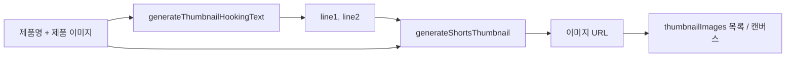

# 쇼핑 숏폼 · 썸네일 생성기 기능 명세

**대상:** WingsAIStudio 쇼핑 숏폼 (`app/WingsAIStudioShotForm/shopping`)  
**핵심 구현:** `shopping/actions.ts` — `generateThumbnailHookingText`, `generateShortsThumbnail`  
**UI 진입:** `shopping/page.tsx` — `handleGenerateThumbnail`

---

## 1. 목적·산출물

| 항목 | 설명 |
|------|------|
| **목적** | 유튜브 쇼핑 쇼츠에 맞는 **9:16** 세로 썸네일 이미지 URL을 생성한다. |
| **산출물** | Replicate가 반환하는 **이미지 URL**(문자열). 캔버스(1080×1920)에 비율 유지로 표시 가능. |
| **2단 구성** | ① GPT로 **2줄 후킹 문구** → ② Replicate `nano-banana-pro`로 **이미지**(문구·제품 반영). |

---

## 2. 데이터 흐름



1. **전제 조건 (UI):** `productName` 필수. **제품 이미지(`productImage`)** 필수 — 없으면 `handleGenerateThumbnail`에서 `제품 이미지가 필요합니다` 오류.
2. **API 키:** Replicate는 **필수** (`shotform_replicate_api_key`). OpenAI(GPT)는 **선택** — 없으면 후킹 문구는 **8종 중 랜덤** 기본 세트 사용.
3. **후킹 문구**는 상태 `thumbnailHookingText`에 반영 후, 동일 객체가 썸네일 프롬프트에 전달된다.

---

## 3. API·외부 서비스

### 3.1 후킹 문구 — OpenAI

| 항목 | 값 |
|------|-----|
| 엔드포인트 | `POST https://api.openai.com/v1/chat/completions` |
| 모델 | `gpt-4o-mini` |
| `response_format` | `{ type: "json_object" }` |
| `max_tokens` | `100` |
| `temperature` | `1.0` |
| 인증 | `Authorization: Bearer {GPT_API_KEY}` |
| 키 우선순위 | 인자 `apiKey` → `GPT_API_KEY` / `OPENAI_API_KEY` / `CHATGPT_API_KEY` (서버 env) |

**GPT 키가 없을 때:** 8개의 고정 훅 중 **랜덤 1개** 반환(예: `"99%가 모르는"` / `"충격 가격"` 등). API 실패·JSON 파싱 실패·`line1`/`line2` 누락 시 → `"이거 안 쓰면"` / `"손해봅니다"` 로 보정 또는 대체.

**System/User 규칙 요약:**

- 반드시 **JSON** `{"line1":"...","line2":"..."}` 만 응답.
- 두 줄 모두 **비어 있지 않고**, 서로 다른 내용.
- **숫자 포함**(99%, 3초, 1위 등), 제품 카테고리(청소기·화장품 등)에 맞는 톤.
- 각 줄 대략 **짧은 문구**(가이드상 5~10자 느낌).

### 3.2 썸네일 이미지 — Replicate

| 항목 | 값 |
|------|-----|
| 생성 URL | `POST https://api.replicate.com/v1/models/google/nano-banana-pro/predictions` |
| 인증 | `Authorization: Bearer {REPLICATE_API_TOKEN}` |
| 키 | 인자 또는 `REPLICATE_API_TOKEN` (env) |
| 입력 `input` | `prompt` (영문 대형 템플릿), `aspect_ratio`: `"9:16"`, 선택 `image_input`: `data:image/...;base64,...` 배열 1장 |

**비동기 처리:** 즉시 `succeeded`면 `output`에서 URL 추출. `processing` / `starting`이면 **`GET .../v1/predictions/{id}`** 로 **2초 간격** 폴링, 최대 **120회**(약 4분). 실패·타임아웃 시 에러 throw.

**`image_input` 처리:** 이미 `data:image/`로 시작하면 그대로. 아니면 JPEG/PNG 추정으로 `data:{mime};base64,...` 래핑.

**프롬프트 핵심 (영문 고정):**

- 제품명 삽입, **참조 이미지와 제품 형태 동일 유지** 반복 강조.
- 배경: 실제 사용 장면, **얼굴 노출 없음**, 포토리얼.
- 텍스트: **정확히 2줄** — Line1 상단(흰색), Line2 하단(네온 민트/터코이즈). `hookingText` 없으면 Line1=`productName`, Line2=`쇼츠 영상`.
- 두 줄 **단어 중복 금지**를 프롬프트에서 명시.
- 제품 강조: **빨간 화살표 또는 빨간 원** (#FF0000).

---

## 4. 클라이언트 저장소 키·상태

| 키/상태 | 용도 |
|---------|------|
| `localStorage` `shotform_replicate_api_key` | Replicate |
| `localStorage` `shotform_openai_api_key` | GPT 후킹 문구(선택) |
| `thumbnailImages`, `selectedThumbnailIndex`, `thumbnailUrl` | 생성분 목록·선택 |
| `isGeneratingThumbnail` | 로딩 |

---

## 5. UI 핸들러 요약 (`page.tsx`)

- `handleGenerateThumbnail`: 제품명·Replicate 키 검증 → `generateThumbnailHookingText` → 제품 이미지 없으면 에러 → `generateShortsThumbnail` → 목록에 `{ url, text: hookingText, isCustom: false }` 추가 → 캔버스 1080×1920에 **레터박스/크롭** 방식으로 이미지 표시.

아래는 **핵심 호출부 전체**이다.

```2447:2545:app/WingsAIStudioShotForm/shopping/page.tsx
  // 썸네일 생성 (AI)
  const handleGenerateThumbnail = async () => {
    if (!productName) {
      alert("제품명이 필요합니다.")
      return
    }

    const replicateApiKey = typeof window !== "undefined" ? localStorage.getItem("shotform_replicate_api_key") || undefined : undefined
    const gptApiKey = typeof window !== "undefined" ? localStorage.getItem("shotform_openai_api_key") || undefined : undefined

    if (!replicateApiKey) {
      alert("Replicate API 키가 필요합니다. 메인 화면의 설정(톱니바퀴 아이콘)에서 API 키를 입력해주세요.")
      return
    }

    setIsGeneratingThumbnail(true)
    setError("")

    try {
      // 제품 이미지가 있으면 base64로 변환
      let imageBase64: string | undefined = undefined
      if (productImage) {
        imageBase64 = productImage
      }

      // 1. 후킹 문구 생성
      const hookingText = await generateThumbnailHookingText(productName, gptApiKey)
      setThumbnailHookingText(hookingText)

      // 2. 제품 이미지 확인
      if (!imageBase64) {
        throw new Error("제품 이미지가 필요합니다.")
      }

      // 3. 나노바나나로 썸네일 생성 (제품 이미지 + 텍스트 포함)
      const thumbnail = await generateShortsThumbnail(productName, replicateApiKey, imageBase64, hookingText)
      
      // 4. 썸네일 목록에 추가
      const newThumbnail = {
        url: thumbnail,
        text: hookingText,
        isCustom: false
      }
      setThumbnailImages(prev => [...prev, newThumbnail])
      setSelectedThumbnailIndex(thumbnailImages.length)
      setThumbnailUrl(thumbnail)

      // 5. 생성된 썸네일을 캔버스에 표시 (AI 생성 썸네일은 이미 텍스트가 포함되어 있으므로 그대로 표시)
      setTimeout(() => {
        if (thumbnailCanvasRef.current) {
          const canvas = thumbnailCanvasRef.current
          const ctx = canvas.getContext("2d")
          if (ctx) {
            canvas.width = 1080
            canvas.height = 1920
            const img = new Image()
            img.crossOrigin = "anonymous"
            img.src = thumbnail
            img.onload = () => {
              // 비율 유지하며 그리기
              const imgAspect = img.width / img.height
              const canvasAspect = canvas.width / canvas.height
              
              let drawWidth: number
              let drawHeight: number
              let offsetX: number
              let offsetY: number
              
              if (imgAspect > canvasAspect) {
                // 이미지가 더 넓음 - 높이에 맞추고 좌우 크롭
                drawHeight = canvas.height
                drawWidth = drawHeight * imgAspect
                offsetX = (canvas.width - drawWidth) / 2
                offsetY = 0
              } else {
                // 이미지가 더 높음 - 너비에 맞추고 상하 크롭
                drawWidth = canvas.width
                drawHeight = drawWidth / imgAspect
                offsetX = 0
                offsetY = (canvas.height - drawHeight) / 2
              }
              
              // 검은 배경으로 채우기
              ctx.fillStyle = "black"
              ctx.fillRect(0, 0, canvas.width, canvas.height)
              
              // 이미지 그리기 (비율 유지)
              ctx.drawImage(img, 0, 0, img.width, img.height, offsetX, offsetY, drawWidth, drawHeight)
            }
          }
        }
      }, 100)
    } catch (error) {
      console.error("썸네일 생성 실패:", error)
      setError(`썸네일 생성에 실패했습니다: ${error instanceof Error ? error.message : "알 수 없는 오류"}`)
    } finally {
      setIsGeneratingThumbnail(false)
    }
  }
```

---

## 6. 전체 서버 액션 코드 (`actions.ts`)

아래는 저장소 기준 **썸네일 후킹 + 썸네일 생성** 함수 전문이다 (`actions.ts`와 동일).

```2404:2739:app/WingsAIStudioShotForm/shopping/actions.ts
// 썸네일 후킹 문구 생성
export async function generateThumbnailHookingText(
  productName: string,
  apiKey?: string
): Promise<{ line1: string; line2: string }> {
  const GPT_API_KEY = apiKey || process.env.GPT_API_KEY || process.env.OPENAI_API_KEY || process.env.CHATGPT_API_KEY

  if (!GPT_API_KEY) {
    // API 키가 없으면 자극적인 기본 문구 중 랜덤 선택
    const defaultHooks = [
      { line1: "99%가 모르는", line2: "충격 가격" },
      { line1: "3초만에 완판", line2: "이유 공개" },
      { line1: "500만명이 찾는", line2: "꿀템 정체" },
      { line1: "품절 임박", line2: "마지막 기회" },
      { line1: "1위 제품의", line2: "숨겨진 비밀" },
      { line1: "10배 더 싸게", line2: "사는 방법" },
      { line1: "역대급 할인", line2: "지금 아니면" },
      { line1: "충격 실화", line2: "이 가격 맞아?" }
    ]
    return defaultHooks[Math.floor(Math.random() * defaultHooks.length)]
  }

  try {
    const response = await fetch("https://api.openai.com/v1/chat/completions", {
      method: "POST",
      headers: {
        Authorization: `Bearer ${GPT_API_KEY}`,
        "Content-Type": "application/json",
      },
      body: JSON.stringify({
        model: "gpt-4o-mini",
        messages: [
          {
            role: "system",
            content: `당신은 유튜브 쇼츠 썸네일 후킹 문구 작성 전문가입니다.

절대적 규칙 (무조건 준수):
1. 반드시 두 줄로 작성해야 합니다 (한 줄로 작성하면 안 됨)
2. line1과 line2 모두 반드시 포함되어야 합니다
3. 각 줄은 완전한 문구여야 하며, 빈 문자열이면 안 됩니다
4. 두 줄은 서로 다른 내용이어야 합니다

중요: 제품명을 분석하여 해당 제품의 핵심 특징/효과/장점을 파악하고, 그에 맞는 맞춤형 후킹 문구를 작성하세요.

제품 분석 방법:
- 청소기 -> 청소 효율, 흡입력, 편리함
- 화장품/세럼 -> 피부 효과, 동안, 탄력
- 건강식품 -> 건강 효과, 에너지, 다이어트
- 주방용품 -> 요리 시간 단축, 맛, 편리함
- 전자기기 -> 성능, 가성비, 혁신

핵심 규칙:
1. 반드시 숫자를 포함 (99%, 3초, 1위, 500만, 10배, 50% 등)
2. 첫 번째 줄 (line1): 제품 특징 + 숫자 + 충격 (5~10자) - 반드시 작성
3. 두 번째 줄 (line2): 제품 효과/결과 + 긴박감 (5~10자) - 반드시 작성
4. 제품과 직접 연관된 문구여야 함!
5. 두 줄 모두 반드시 존재해야 하며, 각각 의미 있는 내용이어야 함

제품별 예시 (모두 두 줄):
- 무선청소기: line1: "99%가 모르는", line2: "청소 꿀팁"
- 비타민C세럼: line1: "피부과 의사도 놀란", line2: "동안 비결"  
- 에어프라이어: line1: "3분 요리의", line2: "충격 비밀"
- 다이어트 식품: line1: "2주만에 -5kg", line2: "실화입니다"
- 무선이어폰: line1: "애플도 인정한", line2: "갓성비 정체"
- 마사지기: line1: "만성피로 3일만에", line2: "해결 비법"

응답 형식 (절대 준수):
반드시 다음 JSON 형식으로만 응답하세요. line1과 line2 모두 반드시 포함되어야 합니다:
{"line1": "첫번째줄", "line2": "두번째줄"}

절대 한 줄로만 작성하지 마세요. 반드시 두 줄(line1, line2) 모두 작성해야 합니다.`
          },
          {
            role: "user",
            content: `제품명: ${productName}

위 제품의 핵심 특징과 장점을 분석하고, 이 제품에 딱 맞는 자극적인 후킹 문구를 작성해주세요.

중요 요구사항:
1. 반드시 두 줄(line1, line2)로 작성해야 합니다
2. 한 줄로만 작성하면 안 됩니다
3. line1과 line2 모두 반드시 포함되어야 합니다
4. 각 줄은 완전한 문구여야 하며, 빈 문자열이면 안 됩니다
5. 반드시 숫자를 포함하고, 제품과 직접 연관된 문구여야 합니다

응답 형식:
{"line1": "첫번째줄", "line2": "두번째줄"}`
          }
        ],
        response_format: { type: "json_object" },
        max_tokens: 100,
        temperature: 1.0,
      }),
    })

    if (!response.ok) {
      throw new Error(`API 호출 실패: ${response.status}`)
    }

    const data = await response.json()
    const content = data.choices[0]?.message?.content

    if (!content) {
      throw new Error("후킹 문구 생성에 실패했습니다.")
    }

    let parsed: { line1?: string; line2?: string }
    try {
      parsed = typeof content === 'string' ? JSON.parse(content) : content
    } catch (e) {
      console.error("[Shopping] JSON 파싱 실패:", e)
      return {
        line1: "이거 안 쓰면",
        line2: "손해봅니다"
      }
    }

    if (!parsed.line1 || !parsed.line2) {
      console.warn("[Shopping] line1 또는 line2가 없음:", parsed)
      return {
        line1: parsed.line1 || "이거 안 쓰면",
        line2: parsed.line2 || "손해봅니다"
      }
    }

    return {
      line1: parsed.line1.trim(),
      line2: parsed.line2.trim()
    }
  } catch (error) {
    console.error("[Shopping] 후킹 문구 생성 실패:", error)
    return {
      line1: "이거 안 쓰면",
      line2: "손해봅니다"
    }
  }
}

// 유튜브 쇼츠 썸네일 생성
export async function generateShortsThumbnail(
  productName: string,
  replicateApiKey?: string,
  productImageBase64?: string,
  hookingText?: { line1: string; line2: string }
): Promise<string> {
  const REPLICATE_API_TOKEN = replicateApiKey || process.env.REPLICATE_API_TOKEN

  if (!REPLICATE_API_TOKEN) {
    throw new Error("Replicate API 키가 설정되지 않았습니다. 설정에서 API 키를 입력해주세요.")
  }

  try {
    console.log("[Shopping] 쇼츠 썸네일 생성 시작")
    
    const textLines = hookingText 
      ? `${hookingText.line1}\n${hookingText.line2}`
      : `${productName} 쇼츠 영상`
    
    const thumbnailPrompt = `YouTube shopping shorts thumbnail with text style.

Product: ${productName}

CRITICAL PRODUCT PRESERVATION RULES (MUST FOLLOW - ABSOLUTELY MANDATORY):
- The product's physical shape, proportions, dimensions, and design must be preserved EXACTLY as shown in the reference image
- Product must NOT be deformed, abstracted, redesigned, or modified in any way
- Product must remain recognizable and maintain its original form, structure, and appearance
- Do NOT alter the product's structure, size, shape, proportions, or appearance
- The product in the image must match the reference product image EXACTLY
- Maintain exact original product features, buttons, switches, controls, and design elements from reference image
- Do NOT add new features, buttons, switches, or controls that are not present in the original product
- Do NOT remove or modify any existing features, buttons, or design elements from the original product
- Product's original design and structure must be preserved accurately (exact product design preservation, maintain original product structure)
- The product's actual appearance must be accurately reflected (product preservation, exact product shape and features maintained)
- Only maintain original product features, buttons, and design elements from the reference image
- Never add new features, buttons, or switches not present in the original
- Exact original product design and structure must be preserved

Background: Show the product being actively used in a real-world scenario. The product's main function must be clearly demonstrated. Hands operating or using the product are allowed. Realistic product usage scene, natural lighting, authentic environment. Photo-realistic style, not illustration.

Text to display (CRITICAL - MUST FOLLOW EXACTLY - ABSOLUTELY MANDATORY):
- Display EXACTLY two lines of text (NOT one line, NOT three lines, EXACTLY two lines)
- Line 1 (top line): "${hookingText ? hookingText.line1 : productName}"
- Line 2 (bottom line): "${hookingText ? hookingText.line2 : '쇼츠 영상'}"
- BOTH lines MUST be displayed - Line 1 AND Line 2 are REQUIRED
- DO NOT combine the two lines into one
- DO NOT display only one line
- DO NOT skip either line
- ABSOLUTELY NO duplicate words between the two lines
- Each line must have completely different words
- If any word appears in Line 1, it must NOT appear in Line 2
- If any word appears in Line 2, it must NOT appear in Line 1
- The two lines must be distinct and non-repetitive
- Display exactly as provided above, no variations, no duplicates
- Line 1 must be on top, Line 2 must be on bottom
- Both lines must be clearly visible and readable

Text style requirements:
- Very bold Korean typography
- Huge text, high contrast
- EXACTLY two lines of text displayed prominently (no more, no less)
- First line (top): white text only (no stroke, no outline)
- Second line (bottom): neon mint / turquoise text only (bright mint green or turquoise color, no stroke, no outline)
- Flat design, no heavy shadow
- Optimized for mobile readability
- Text should look like it's overlaid on a photo
- Photo-realistic text rendering

Image requirements:
- Product usage scene as background (photo-realistic)
- Product being actively used (product shape, structure, features, buttons, and design MUST be preserved exactly as in reference image)
- Product must maintain exact original form, features, buttons, and design elements from reference image
- Do NOT add new features, buttons, or controls not present in the original product
- Hands operating the product are visible
- Natural, realistic environment
- High quality, professional photography style
- 9:16 vertical aspect ratio
- No human faces, no face visible
- Realistic lighting and shadows
- Product must be the exact same product from the reference image (exact product design preservation, maintain original product structure, exact product shape and features maintained)

Product highlighting elements:
- Add a bright red arrow or red circle to highlight and point to the product
- Red arrow should point directly at the product
- Red circle should surround or highlight the product area
- Use vibrant red color (#FF0000 or similar) for high visibility
- Arrow or circle should be bold and eye-catching
- These elements should draw attention to the product
- Professional YouTube thumbnail style highlighting`

    let imageInput: string[] | undefined = undefined

    if (productImageBase64) {
      if (productImageBase64.startsWith("data:image/")) {
        imageInput = [productImageBase64]
      } else {
        const mimeType = productImageBase64.includes("/9j/") ? "image/jpeg" : "image/png"
        imageInput = [`data:${mimeType};base64,${productImageBase64}`]
      }
    }

    const response = await fetch("https://api.replicate.com/v1/models/google/nano-banana-pro/predictions", {
      method: "POST",
      headers: {
        Authorization: `Bearer ${REPLICATE_API_TOKEN}`,
        "Content-Type": "application/json",
      },
      body: JSON.stringify({
        input: {
          prompt: thumbnailPrompt,
          aspect_ratio: "9:16",
          ...(imageInput && {
            image_input: imageInput,
          }),
        },
      }),
    })

    if (!response.ok) {
      const errorText = await response.text()
      console.error("[Shopping] 썸네일 생성 오류:", errorText)
      throw new Error(`썸네일 생성 실패: ${response.status} - ${errorText.substring(0, 200)}`)
    }

    const data = await response.json()

    if (data.status === "succeeded" && data.output) {
      let imageUrl: string
      if (Array.isArray(data.output) && data.output.length > 0) {
        imageUrl = typeof data.output[0] === "string" ? data.output[0] : data.output[0].url || String(data.output[0])
      } else if (typeof data.output === "string") {
        imageUrl = data.output
      } else if (data.output && typeof data.output === "object" && (data.output as any).url) {
        imageUrl = (data.output as any).url
      } else {
        imageUrl = String(data.output)
      }

      console.log("[Shopping] 썸네일 생성 완료:", imageUrl)
      return imageUrl
    } else if (data.status === "processing" || data.status === "starting") {
      const predictionId = data.id
      let attempts = 0
      const maxAttempts = 120

      while (attempts < maxAttempts) {
        await new Promise((resolve) => setTimeout(resolve, 2000))

        const statusResponse = await fetch(`https://api.replicate.com/v1/predictions/${predictionId}`, {
          headers: {
            Authorization: `Bearer ${REPLICATE_API_TOKEN}`,
          },
        })

        if (!statusResponse.ok) {
          throw new Error(`상태 확인 실패: ${statusResponse.status}`)
        }

        const statusData = await statusResponse.json()

        if (statusData.status === "succeeded" && statusData.output) {
          let imageUrl: string
          if (typeof statusData.output === "string") {
            imageUrl = statusData.output
          } else if (Array.isArray(statusData.output) && statusData.output.length > 0) {
            imageUrl = typeof statusData.output[0] === "string" ? statusData.output[0] : statusData.output[0].url || statusData.output[0]
          } else if (statusData.output.url) {
            imageUrl = statusData.output.url
          } else {
            imageUrl = String(statusData.output)
          }

          console.log("[Shopping] 썸네일 생성 완료 (폴링):", imageUrl)
          return imageUrl
        } else if (statusData.status === "failed") {
          throw new Error(`썸네일 생성 실패: ${statusData.error || "알 수 없는 오류"}`)
        }

        attempts++
      }

      throw new Error("썸네일 생성 시간 초과")
    } else {
      throw new Error(`썸네일 생성 실패: ${data.error || "알 수 없는 오류"}`)
    }
  } catch (error) {
    console.error("[Shopping] 썸네일 생성 실패:", error)
    throw error
  }
}
```

> 참고: `const textLines` 변수는 계산만 하고 `thumbnailPrompt`에는 미사용이며, 저장소 `actions.ts`와 동일하다.

---

## 7. 트러블슈팅

| 증상 | 원인 | 대응 |
|------|------|------|
| 썸네일 생성 버튼이 반응 없음 | Replicate 키 없음 | 설정에서 `shotform_replicate_api_key` 입력 |
| "제품 이미지가 필요합니다" | `productImage` 비어 있음 | 제품 단계에서 이미지 업로드 |
| 시간 초과 | Replicate 큐 지연 | 폴링 120회 초과 시 에러 — 재시도 |
| CORS/캔버스 | 외부 이미지 도메인 | `crossOrigin = "anonymous"` 사용 중 |

---

## 8. 관련 문서

- 프롬프트 중심 정리: `app/WingsAIStudioShotForm/shopping/docs/쇼핑_숏폼_썸네일_프롬프트.md`
